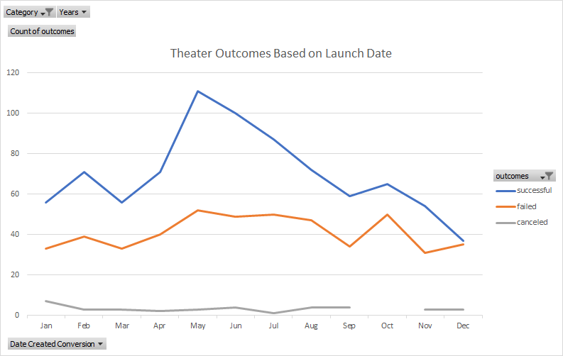
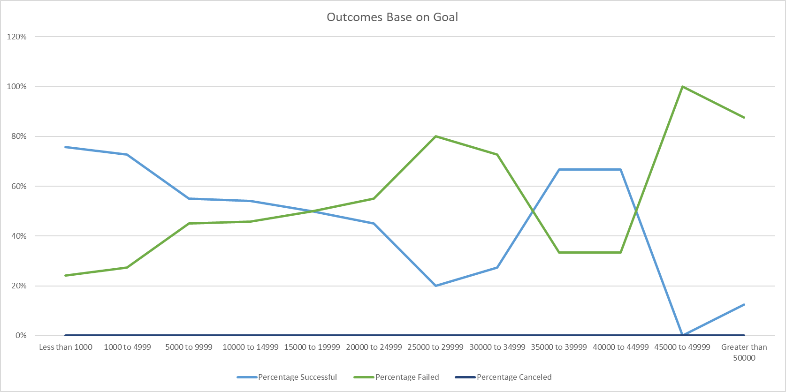

Kickstarting with Excel
## Overview of Project
### The purpose of this project is to compare the outcomes of Kickstarter campaigns based on their fundraising goals and launch dates.
## Analysis and Challenges
### Analysis of Outcomes Based on Launch Date
The data shows that there are more successful campaigns started in May than any other month. After May, June and July had the next highest number of successful campaigns. In comparison, Decmeber had almost as many failed campaigns as successful compaigns. Decmeber was also the month with the lowest number of successful campaigns.

### Analysis of Outcomes Based on Goals
The highest success rate for plays came from campaigns with a goal of less than a 1000 at 76%, followed by the 1000 to 4999 goal at 73%. As the goal numbers become larger the success rate fell. It began to climb again, peaking at 67% for the 35000 to 39999 and 40000 to 44999 goal ranges, only to fall to 0.

### Challenges and Difficulties Encountered
The challenge with this dataset was that some of the data had to be reformated. All the dates within the data were in Unix format and had to be converted to a standard format. Also, the parent categories and subcategories had to be placed in their own columns for the data to be properly examined.
## Results
- When looking at the Outcomes Based on Launch Date chart, the best months to launch a campaign are May and June. On the otherside, the month with the lowest chance of a successful campaign would be December.
- When looking at the Outcomes Based on Goals chart, the highest likelihood of a successful campaign comes from having a goal of $4,999 or less.
- Possible limitations are the dataset does not give us the ability to look into how the quality of the campaign itself effects the outcome. Does the amount of detail given on the Kickstarter page or the consistency of campaign updates play a role in the potential successful funding of a campaign?
- Other tables and graphs that would be beneficial would be looking at the total number of backers compared to the success of a campaign. It would also be beneficial to see how close the failed campaigns came to reaching their goal compared to what the overall goal was. Did the failing campaigns with a smaller goal come closer than failing campaigns with larger goals?
